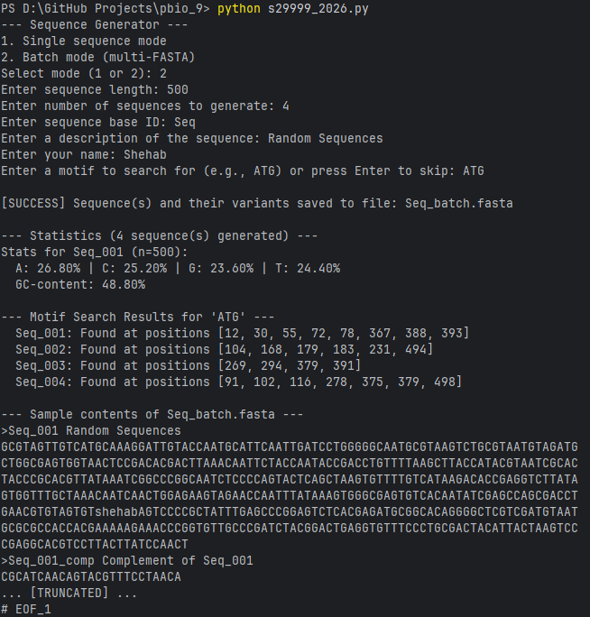
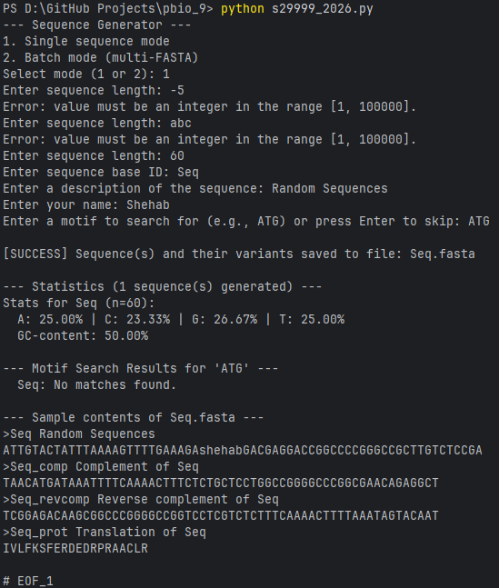

# pbio_9

A program that Generates single or multi-FASTA files of random DNA sequences depending on program mode at runtime, calculates statistics, finds motifs, generates complements and translations, and inserts a user's name visually into the sequence.

# Batch moode example output and interaction

# Single mode example output and interaction

